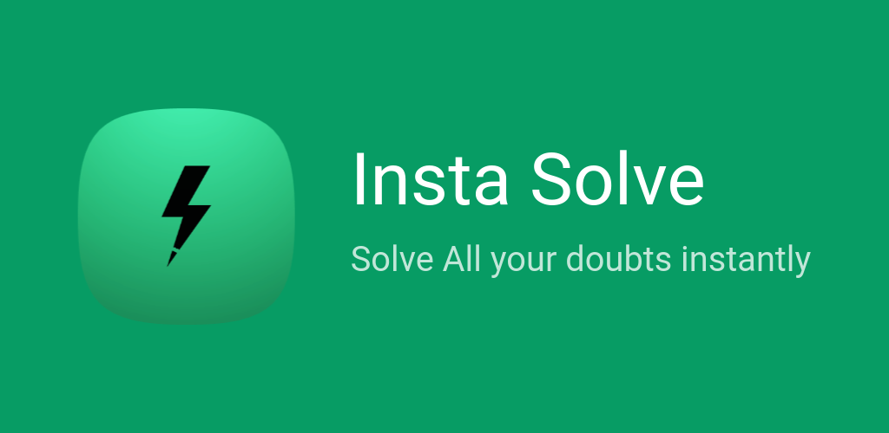

# Insta Solve
 Doubts are Fun

https://www.youtube.com/watch?v=IYkIOJWMwHc

Vote the submission here: https://ai.google.dev/competition/projects/insta-solve

# Getting the App

Releases are not available as of now. But you can still build the app yourself!

# Building

📝 Checklist
 1. Make sure you have the latest [flutter sdk](https://docs.flutter.dev/get-started/install) installed and running up!
 2. Install the latest Android SDK

After you have the project open in your favourite IDE,
 1. Create a `.env` file in the project root
 2. Add a key `API_KEY=<Your API Key Here>`
 3. Run `dart run build_runner build` to create the `env` file containing the API_KEY.
 4. Create a `key.properties` file in `android/` and add the following contents
 ```properties
 storePassword=<password>
 keyPassword=<password>
 keyAlias=<alias>
 storeFile=<keystore_file_path>
 ```

 OR you can follow the instructions here [Sign The App](https://docs.flutter.dev/deployment/android#sign-the-app)

Now you can build the apk using

 4. `flutter build apk`
 5. Install to your device using `adb install build/app/outputs/flutter-apk/<apk_name>.apk` after connecting your android device!
